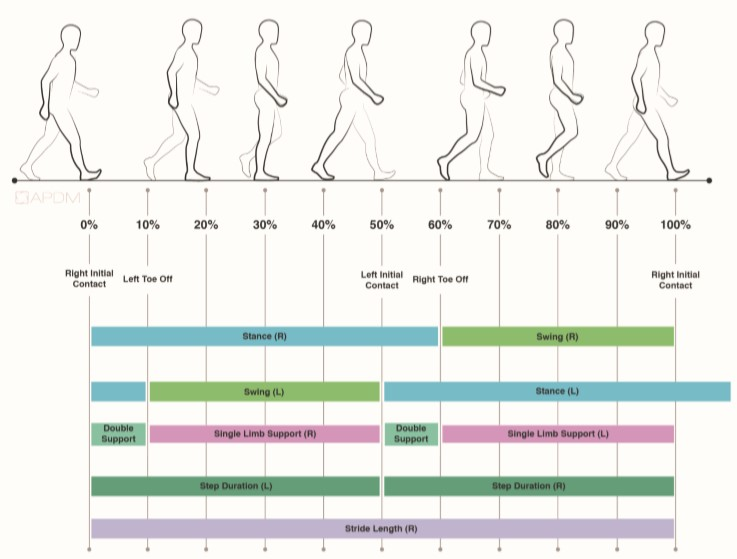

### Introduction About The Dataset 


In this project, the APDM’s advanced wearable sensors, Opalsand Mobility Lab have been used to collect, analyze, and store outcome measures. This process takes less than five minutes and the number of sensors is 3 or 6.

The used dataset contains many h5 files that can be openedusing Python. There are many variables that are used in this dataset.  Each file in this dataset contains variables about somebody who is walking or standing.

Here, I worked on one nested data structure h5 file which contains the features of one walking person. Walking corridor must be at least7 meters in length. The data size of each independent variable (feature) is not the same. 

This is an example of nested data structure where the number of rows is 113 rows: 

Events/Gait/Lower Limb/All Steps Left 

Events/Gait/Lower Limb/All Steps Right 
 
Events/Gait/Lower Limb/Cycle Validity with Heel Strike Times  


### Gait Cycle Analysis 

###                           

                                           Figure.1 Gait Cycle Analysis


### Read h1 File (Getting the headers/keys)

```
f =  h5py.File("walking5.h5",'r')
for name in f:
    print(name)
res = hdfdict.load("walking5.h5")
print(res.keys())

```

### Anticipatory Postural Adjustment 

Anticipatory postural adjustments are defined as the activation of postural muscles in a feedforward manner before a voluntary movement begins.

### Fields Description of the Anticipatory postural adjustments

The measures of the Anticipatory postural adjustments including 'First Step Duration' and 'First Step Range of Motion'.

|    Field Name  | Description |
| ------------- | --------------------- |
| First Step Duration |The duration of the period spanning from the end of the APA to the initial contact of the first step|
|First Step Range of Motion | The integrated angular velocity of the stepping foot from the end of the APA to the initial contact of the step 

The features of Anticipatory postural adjustments variable is put into two data frames where the number of rows are 2 rows. 

```
First_Step_Duration = res['Measures']['Anticipatory Postural Adjustment']['First Step Duration']
df4 = pd.DataFrame(First_Step_Duration)
df4.columns = ['AnticipatoryPosturalAdjustmentFirstStepDuration']
First_Step_Range_of_Motion = res['Measures']['Anticipatory Postural Adjustment']['First Step Range of Motion'] 
df5 = pd.DataFrame(First_Step_Range_of_Motion)
df5.columns = ['AnticipatoryPosturalAdjustmentFirstStepRangeofMotion']

```

### Lower Limb

The leg region is the part of the lower limb that lies between the knee and the rounded medial and lateral prominences 
that flank the ankle joint. It connects the knee and foot.

Gait measures are detected, analyzed, and averaged over the extent of the walking duration of the subject. All measures are assessed for asymmetry and variability.


###                          

                            Figure.2 Full Body Gait Measures: Gait Cycle Analysis