### Introduction About The Dataset 


In this project, the APDM’s advanced wearable sensors, Opalsand Mobility Lab have been used to collect, analyze, and store outcome measures. This process takes less than five minutes and the number of sensors is 3 or 6.

The used dataset contains many h5 files that can be openedusing Python. There are many variables that are used in this dataset.  Each file in this dataset contains variables about somebody who is walking or standing.

Here, I worked on one nested data structure h5 file which contains the features of one walking person. Walking corridor must be at least7 meters in length. The data size of each independent variable (feature) is not the same. 

This table contains the node paths and the number of rows of each node path: 


Events/Gait/Lower Limb/All Steps Left 

Events/Gait/Lower Limb/All Steps Right 
 
Events/Gait/Lower Limb/Cycle Validity with Heel Strike Times  


### Gait Cycle Analysis 

###                               
                                           Figure.1 Gait Cycle Analysis

### Import packages

```
import pandas as pd
import hdfdict
import numpy as np
import h5py,time

```

|    Package Name  | Description |
| ------------- | --------------------- |
|pandas  |pandas is a fast, powerful, flexible and easy to use open source data analysis and manipulation tool, built on top of the Python programming language|
|hdfdict|hdfdict helps h5py to dump and load python dictionaries|
|h5py | The h5py package is a Pythonic interface to the HDF5 binary data format with storing huge amounts of numerical data, and easily manipulate that data from NumPy|
|xlsxwriter|XlsxWriter is a Python module that can be used to write text, numbers, formulas and hyperlinks to multiple worksheets|


### Read h1 File (Getting the headers/keys)

```
f =  h5py.File("walking5.h5",'r')
for name in f:
    print(name)
res = hdfdict.load("walking5.h5")
print(res.keys())

```

### Collect Into DataFrames

All fields has been collected into datafrmes where the number of columns for each dataframe is not constant. We iterate through all the dataframes dictionary items and create a new
sheet. 

```
dfd = {} # {1:df1,5:df2,113:df3<-add col}
         # Key indicates to the number of rows for each Dataframe

def print_attrs(name, obj):
    global dfd
    if '<class \'h5py._hl.dataset.Dataset\'>' == str(type(obj)):
        k= str(len(obj))
        if k not in dfd.keys():
            df = pd.DataFrame()
            df[name] = obj
            dfd[k] = df
            #print(name,"Adding new key for len ", k)
        else:
            df = dfd[k]
            df[name] = obj
            dfd[k] = df
            #print(name,"Adding col to dfd index ", k)
        #print(dfd.keys())
    for key, val in obj.attrs.items():
        print("    %s: %s" % (key, val),type(val))

```

### Collect All Dataframes in an Excel file 

All Dataframes collected in spreadsheets for one Excel file. Each sheet contains a Dataframe. For example, sheet 1 contaion Dataframe1, sheet2 contains Dataframe 2, sheet3 contains Dataframe 3, sheet4 contains Dataframe 4, sheet5 contains Dataframe 5 and sheet6 contains Dataframe 6
The number of columns and rows in each sheet is not the same. 

```

writer = pd.ExcelWriter('hd5excelout6.xlsx', engine = 'xlsxwriter')
for k, df in dfd.items():
    print(k,len(df))
    df.to_excel(writer, sheet_name = 'sheet_len_'+k)
writer.save()
writer.close()

```

### Lower Limb

The leg region is the part of the lower limb that lies between the knee and the rounded medial and lateral prominences 
that flank the ankle joint. It connects the knee and foot.

The features of the Lower Limb variable are put into data frames. Gait measures are detected, analyzed, and averaged over the extent of the walking duration of the subject. All measures are assessed for asymmetry and variability.

### Fields Description of Lower Limb 

The measures of the Lower Limb including the Cycle Duration, Gait Speed, Double Support, Step Duration, Stride Length and Swing.  

|    Field Name  | Description |
| ------------- | --------------------- |
|Cycle Duration |The duration of a full gait cycle, measured from the left foot’s initial contact to the next initial contact of the left foot|
|Gait Speed | The forward speed of the subject, measured as the forward distance traveled during the gait cycle divided by the gait cycle duration|
|Double Support | The percentage of the gait cycle in which both feet are on the ground|
|Step Duration| The duration of a step, measured as the period from initial contact of one foot to the next initial contact of the opposite foot|
|Stride Length| The forward distance travelled by a foot during a gait cycle|
|Swing| The percentage of the gait cycle in which the foot is not on the ground|
|Cadence|The number of steps per minute, counting steps made by both feet|
|Foot Clearance | The height of the foot sensor measured at midswing, relative to its start position while standing|
|Lateral Step Variability | In a series of 3 consecutive foot placements of the same foot, the variability of perpendicular deviations of the middle foot placement from the line connecting the first and third |
|Circumduction|The amount that the foot travels perpendicular to forward movement while swinging forward during an individual stride| 
|Foot Strike Angle |The angle of the foot at the point of initial contact. The pitch of the foot when flat is zero and positive when the heel contacts first|
|Toe Off Angle|The angle of the foot as it leaves the floor at push-off. The pitch of the foot when flat is zero|
|Stance|The percentage of the gait cycle in which the foot is on the ground|
|Toe Out Angle|The lateral angle of the foot during the stance phase, relative to the forward motion of the gait cycle. Positive angle is outward rotation|


###                             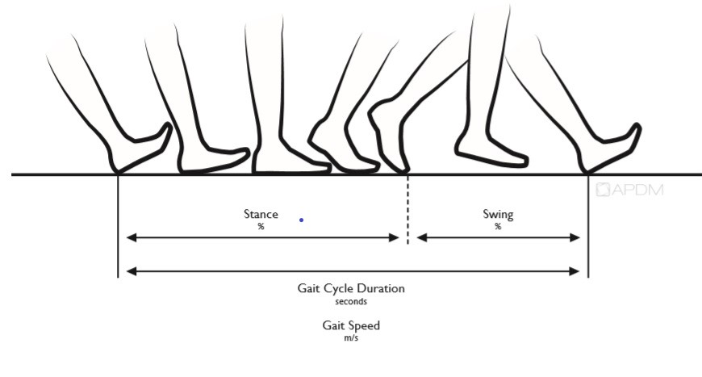
                                  Figure.2 Full Body Gait Measures: Gait Cycle Analysis

###                             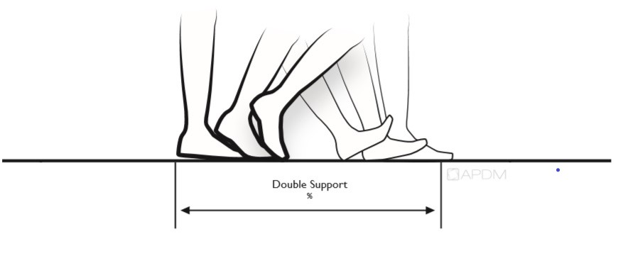
                                 Figure.3 Full Body Gait Measures: Double Support 

###                             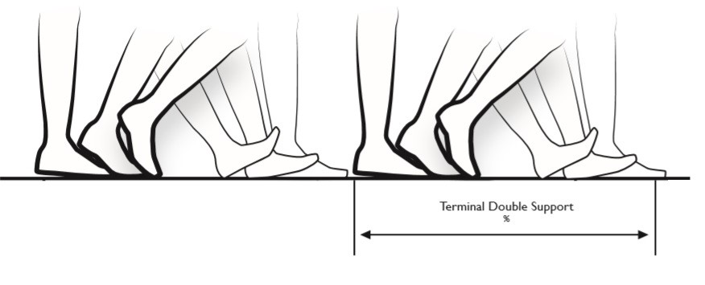   
                                 Figure.4 Full Body Gait Measures: Terminal Double Support 

###                             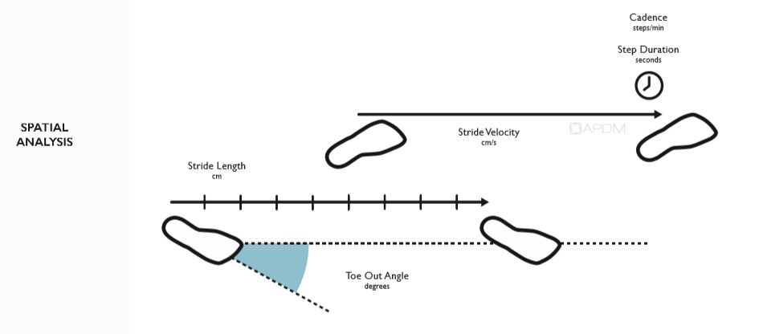  
                                 Figure.5 Full Body Gait Measures: Special Analysis  

###                             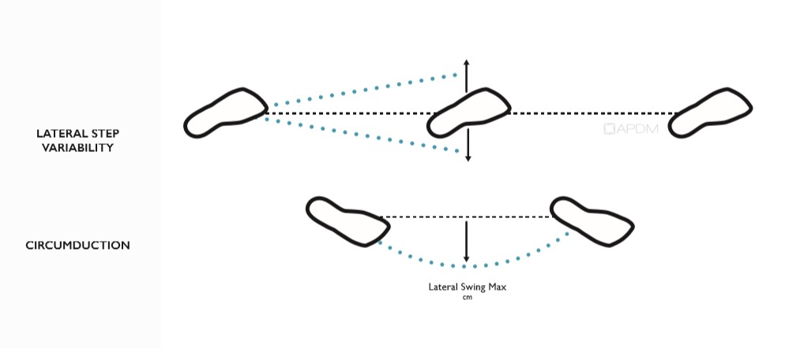 
                                 Figure.6 Full Body Gait Measures: Circumduction

###                             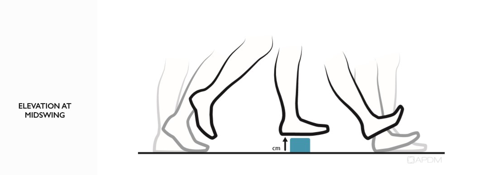
                                 Figure.7 Full Body Gait Measures: Elevation at Midswing   

###                             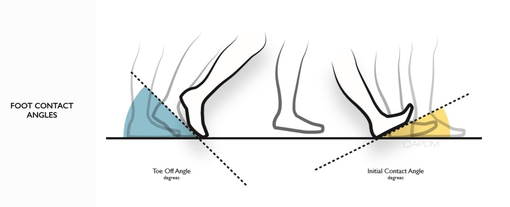   
                                 Figure.8 Full Body Gait Measures: Foot Contact Angles 
 

### Upper Limb

The upper limb or upper extremity is the region in the body extending from the deltoid region up to and including the hand, including the arm, axilla and shoulder.
The features of Upper Limb variable are put into onme Dataframe


### Fields Description of the Upper Limb 
 
The measures of the Upper Limb including the Arm Swing Velocity and Arm Swing Range of Motion. 

|    Field Name  | Description |
| ------------- | --------------------- |
| Arm Swing Velocity  |The maximum rotational velocity of the arm swing|
|Arm Swing Range of Motion | The angular range of the arm swing|


###                                
         Figure.9 Sensor Configuration and Measures: Balance, Lower Limb Gait, Upper Limb Gait, Turning and Sit to Stand  


### Fields Description of the Trunk Range of Motion

The measures of the Trunk Range of Motion including the Coronal, Sagittal and Transverse. 


|    Field Name  | Description |
| ------------- | --------------------- |
| Coronal   |The angular range of the thoracic spine in the sagittal plane (pitch) |
|Sagittal  | The angular range of the arm swing|
|Transverse|The angular range of the thoracic spine in the transverse plane (yaw)|


###                                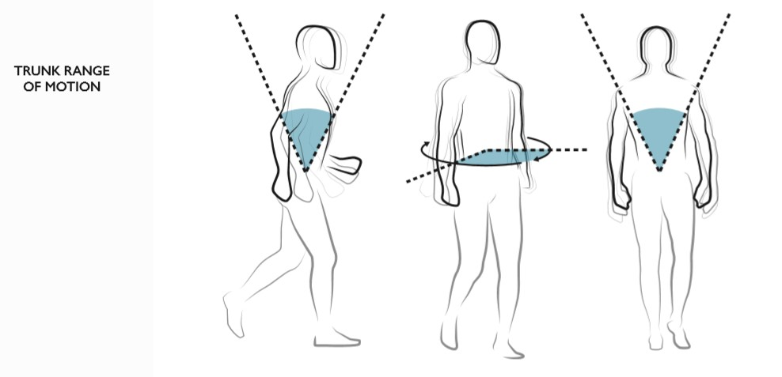
                                               Figure.10 Trunk Range of Motion   


### Lumbar Range of Motion

All postural sway measures are assessed using the Opal movement sensor placed on a subject’s lumbar.  All metrics are reported in Coronal, Sagittal and Transverse planes.

### Fields Description of the Lumbar Range of Motion

The measures of the Lumbar Range of Motion including the Coronal, Sagittal and Transverse. 


|    Field Name  | Description |
| ------------- | --------------------- |
| Coronal   |The angular range of the lumbar spine in the coronal plane (roll)|
| Sagittal  | The angular range of the lumbar spine in the sagittal plane (pitch) |
|Transverse|The angular range of the lumbar spine in the transverse plane (yaw)|


###                                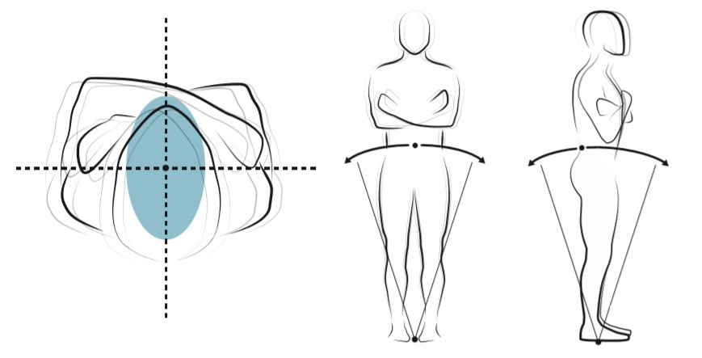
                                               Figure.11 Lumbar Range of Motion  


### Fields Description of Sit To Stand/ Stand To Sit

The measures of the Sit To Stand/ Stand To Sit including the Sit To Stand and Stand To Set.

#### Sit To Stand

|    Field Name  | Description |
| ------------- | --------------------- |
| Duration   |The duration of the sit to stand transition|
| Lean Angle  | The angular range of motion of the trunk during the sit to stand transition|

 
#### Stand To Sit

|    Field Name  | Description |
| ------------- | --------------------- |
| Duration   |The duration of the stand to sit transition|
| Lean Angle  | The angular range of motion of the trunk during the stand to sit transition|

###                                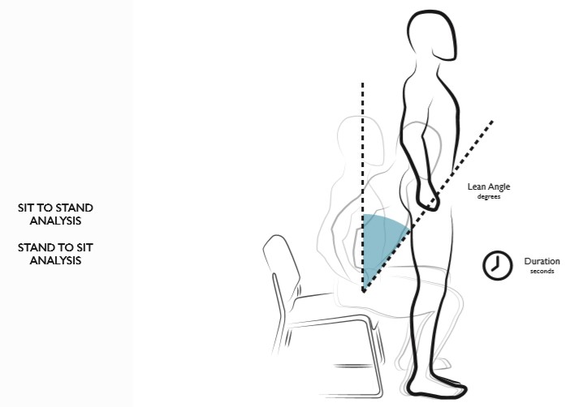
                                               Figure.12 Sit To Stand/Stand To Set  


### Turning Analysis

Postural measures are detected, analyzed, and averaged over the extent of the walking duration of the subject.

### Fields Description of the Turning 

The measures of the Turning including the Angle and Duration and Velocity.

|    Field Name  | Description |
| ------------- | --------------------- |
|Angle|The rotational angle of the turn|
|Duration|The duration of the turn|
|Velocity|The peak angular velocity of the turn|


###                                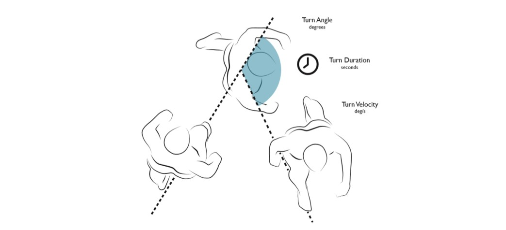
                                                Figure.13 Turning Analysis 


### postural sway

All postural sway measures are assessed using the Opal movement sensor placed on a subject’s lumbar.  All metrics are reported in Coronal, Sagittal and Transverse planes.

### Fields Description of the postural sway

The measures of the postural sway including the Sway Area, RMS Sway, Coronal RMS Sway and Sagittal RMS Sway. 

|    Field Name  | Description |
| ------------- | --------------------- |
|Sway Area |The area of an ellipse covering 95% of the sway angle in both the coronal and sagittal planes |
|RMS Sway |The root mean square (RMS) of the sway angle in both the coronal and sagittal planes|
|Coronal RMS Sway |The root mean square (RMS) of the sway angle in the coronal plane |
|Sagittal RMS Sway|The root mean square (RMS) of the sway angle in the sagittal plane |


###                                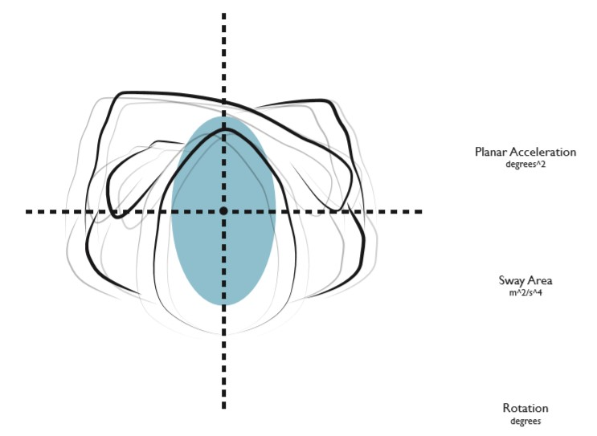
                                  Figure.14 Planar Acceleration, Sway Area and Rotation

###                                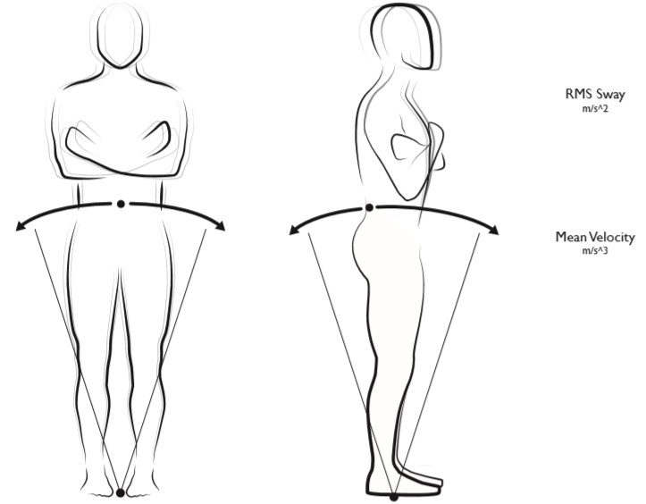
                                          Figure.14 RMS Sway and Mean Velocity 


 


####################


### Anticipatory Postural Adjustment 

Anticipatory postural adjustments are defined as the activation of postural muscles in a feedforward manner before a voluntary movement begins.

### Fields Description of the Anticipatory postural adjustments

The measures of the Anticipatory postural adjustments including 'First Step Duration' and 'First Step Range of Motion'.

|    Field Name  | Description |
| ------------- | --------------------- |
| First Step Duration |The duration of the period spanning from the end of the APA to the initial contact of the first step|
|First Step Range of Motion | The integrated angular velocity of the stepping foot from the end of the APA to the initial contact of the step 

The features of Anticipatory postural adjustments variable are put into two data frames where the number of rows are 2 rows. 

```
First_Step_Duration = res['Measures']['Anticipatory Postural Adjustment']['First Step Duration']
df4 = pd.DataFrame(First_Step_Duration)
df4.columns = ['AnticipatoryPosturalAdjustmentFirstStepDuration']

First_Step_Range_of_Motion = res['Measures']['Anticipatory Postural Adjustment']['First Step Range of Motion'] 
df5 = pd.DataFrame(First_Step_Range_of_Motion)
df5.columns = ['AnticipatoryPosturalAdjustmentFirstStepRangeofMotion']

```


### Collect the data frames in groups

The Data frames, which have the same number of rows, have been collected in one group with converting them to many CSV files. 

```
df_Group1 = pd.concat([df1, df2, df3], axis=1, sort=False)
df_Group2 = pd.concat([df4, df5], axis=1, sort=False)
df_Group3 = pd.concat([df6, df7, df8,df9,df10,df11], axis=1, sort=False) 

Group1_ConvertCSV= df_Group1.to_csv (r'Group1-DataFrame.csv', index = False, header=True)
Group2_ConvertCSV= df_Group2.to_csv (r'Group2-DataFrame.csv', index = False, header=True)
Group3_ConvertCSV= df_Group3.to_csv (r'Group3-DataFrame.csv', index = False, header=True)
```
### Collect all groups in many spreadsheets

The groups, which have different number of rows, have been collected in many spreadsheets for one excel file. 

```
writer = pd.ExcelWriter('Combined in many sheets.xlsx')
df_Group1.to_excel(writer, sheet_name='sheet1', index=False)
df_Group2.to_excel(writer, sheet_name='sheet2', index=False)
Groups_combine_3_4_5.to_excel(writer, sheet_name='sheet3', index=False)
df_Group6.to_excel(writer, sheet_name='sheet4', index=False)
df_Group7.to_excel(writer, sheet_name='sheet5', index=False)
writer.save()

```
